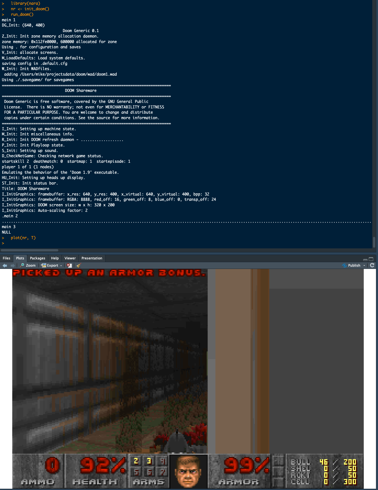

<!-- README.md is generated from README.Rmd. Please edit that file -->

# rdoom

<!-- badges: start -->


<!-- badges: end -->

`{rdoom}` is non-playable version of
[Doom](https://en.wikipedia.org/wiki/Doom_(1993_video_game)) using the
[doomgeneric](https://github.com/ozkl/doomgeneric) codebase.

Suggested way to run this on all platforms:

``` r
remotes::install_github('coolbutuseless/rdoom')
x11(type = 'dbcairo', width = 6, height = 4)
dev.control('inhibit')
doom(nframes = 400)  # increase this number to render more frames.
```

## Limitations

This package is not so much a *proof-of-concept* and more a
*proof-of-limitations*.

- This should be run on a fast graphics device.
  - Using `x11()` should be the best option under macOS/Linux/windows
  - If you are running **RStudio** and forget to manually open a fast
    graphics device, then the default `RStudioGD` graphics device will
    be used and this is **SLOW**.
- Keyboard input is not supported - which means the game is **not
  playable**
  - Given the way `doomgeneric` uses callbacks, it doesn’t seem possible
    to use device events to capture keyboard input (as was done in
    [eventloop](https://github.com/coolbutuseless/eventloop))
- There are graphics glitches.
  - No idea where these glitches are coming from. I’m really only doing
    a `memcpy()` from the rendered buffer into an r buffer, so I don’t
    think it’s my fault.
  - The glitches appear to be produced by the doomgeneric renderer.
    compiler issue? macOS issue? Unknown!!
- There is no audio
- There are still unsafe calls in the C code
  - `printf()`, `putchar()`, `puts()` etc
- If there is an error condition in the game within `doomgeneric` code,
  then it will likely kill your R session as well.

## Future

I’m unsure that the keyboard input problem can ever be solved with this
current approach (using R graphics devices).

## Installation

You can install from [GitHub](https://github.com/coolbutuseless/rdoom)
with:

``` r
# install.packages('remotes')
remotes::install_github('coolbutuseless/rdoom')
```



