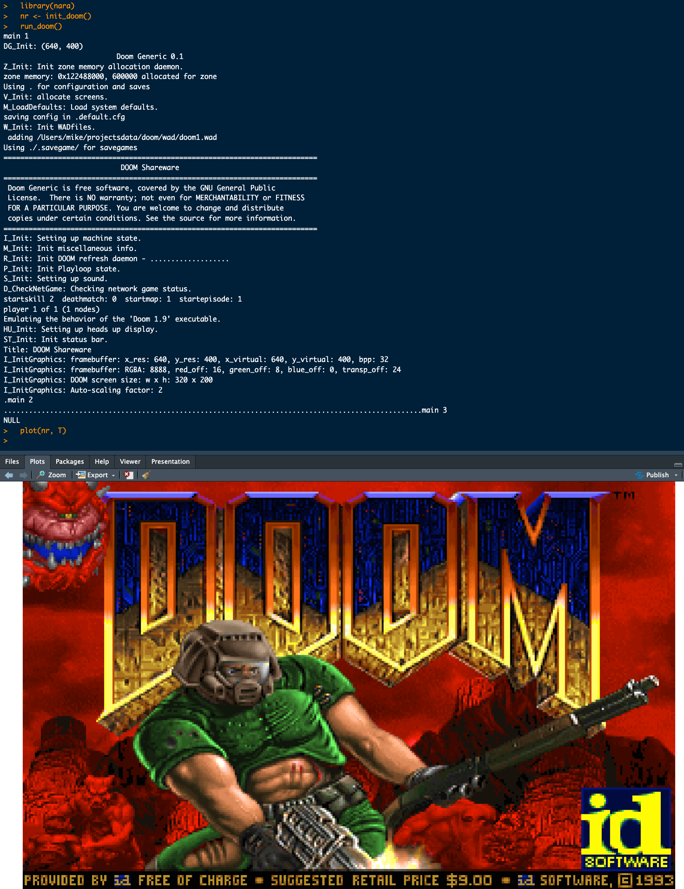

<!-- README.md is generated from README.Rmd. Please edit that file -->

# rdoom

<!-- badges: start -->


<!-- badges: end -->

`{rdoom}` is a playable version of
[Doom](https://en.wikipedia.org/wiki/Doom_(1993_video_game)) for R.

This is really a tech demo for what can be done with the
[tigerfb](https://github.com/coolbutuseless/tigerfb) package
i.e. realtime, interactive (mouse & keyboard) graphical displays in R.

It uses:

- [doomgeneric](https://github.com/ozkl/doomgeneric) as the game engine
- [tigerfb](https://github.com/coolbutuseless/tigerfb) as the
  framebuffer
  - This is a generic framebuffer which can be used for realtime
    interactive graphics in R - with keyboard and mouse controls.

This code should run on macos, linux and windows platforms (but has only
been extensively tested on macos).

Suggested way to run this on all platforms:

``` r
pak::pkg_install('coolbutuseless/tigerfb')
pak::pkg_install('coolbutuseless/rdoom')
rdoom::doom()
```

## Limitations

- There is currently no audio


